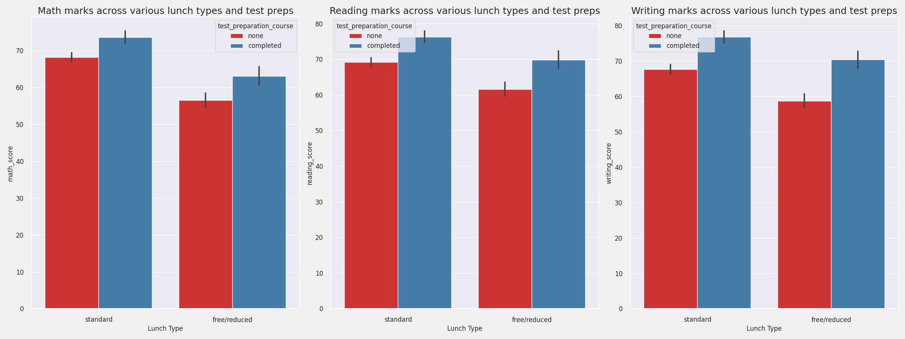
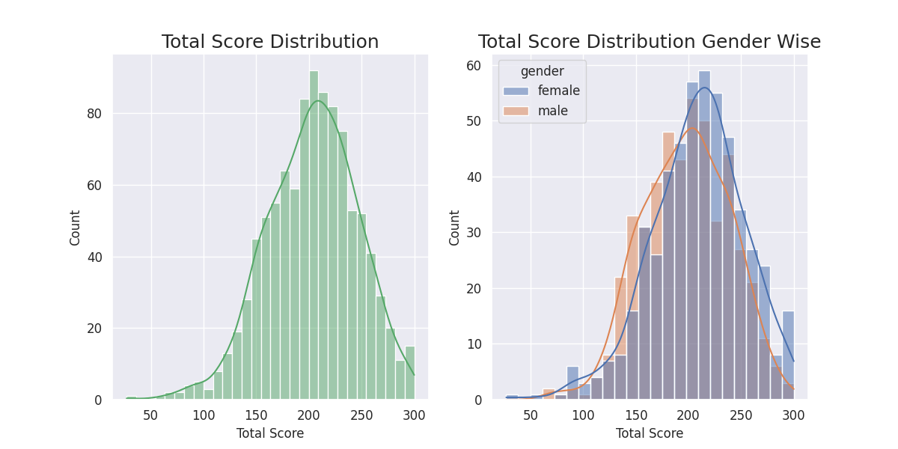

 


# End to End ML Project

## Motivation and a brief of the project
- These days it's getting more common for a person in data team, to wear multiple hats in terms of bringing insights from the sea of data. To gain experience on what it means to wear multiple hats, I created this end to to end project on a simple data set of [Students Performance Dataset](https://www.kaggle.com/spscientist/students-performance-in-exams) from Kaggle.
- The goal of this project is not to derive any magical insights from data, rather, to do a comprehensive work on building an end to end project which includes but is not limited to:
    - Creating [modular folder structure](#t11-folder-structure-creation)
    - Deciding on the [dataset](#action-a1-and-a2)
    - Setup of the [environment](#task-t2)
    - Design and [Develop Components and Pipelines](#action-a3), where components interact with data in backend, whereas the pipelines interact with the user and components to get predictions from a trained ML model and finally provide result to the user.
- Anyone, can simply follow the actions mentioned below to make their own copy of this end to end project. For simple viewing, I will soon host this project via Gradio, cause having an AWS hosted server is not easy on the pocket 🙃. --> [Hosted Gradio App](https://yuvidhepe-studentperformance.hf.space)

## STAR ANALYSIS
- Situation: To gain experience in end-to-end machine learning project development and deployment
- Task: Create a machine learning project from scratch, following the entire pipeline from data collection to model deployment
- Action: Develop a project idea, collect and preprocess the data, perform EDA on data, decide on design and training of the machine learning model, evaluate the model's performance, and deploy the model into a production - environment
- Result: Gain hands-on experience in end-to-end machine learning project development and deployment, with a fully functional machine learning system that can be used for real-world applications

## Insights from the EDA n Model Training
- Here I am simply mapping few insights from the EDA and Model Training, detailed work can be found inside the following jupyter notebooks.
    - [Student Performance Dataset EDA](./assets/files/notebook/2_MODEL_TRAINING.ipynb)
    - [ML Model Training on Dataset](./assets/files/notebook/EDA_Student_performance.ipynb)

### Glancing at Few Plots From EDA and Key Findings From The Plots
-  Student's with parents having masters or bachelors have high scores    


- High scoring students take standard lunch


- Students from a lower Socioeconomic status have a lower avg in all course subjects


- Females lead in pass percentage and also are top-scorers


- Finishing preparation course is benefitial


- All the scores are interrelated


### Insights From Model Training & Testing
- Top 3 Models (With Hyper Parameter Tuning)

| Model     | R2 score          |
|-----------|------------------	|
| Lasso     | 88.29% 	        |
| Ridge     | 87.51% 	        |
| Gradient Boost  | 87.27% 	    |

**The final model used for this project thus is Lasso to make predictions on real-data**
**Metrics Used: R2**

**Why choose R2 as metrics**:
R-squared (R^2) is a commonly used metric to evaluate regression models. It represents the proportion of variance in the dependent variable (math_score in this case) that can be explained by the independent variables (gender, race_ethnicity, parental_level_of_education, lunch, test_preparation_course). A higher R^2 value indicates a better fit of the model to the data.

- Regression Plot of the Lasso Model


## What can be improved
- We can use hyperparameter tuning with more iterations
- We can do feature-engineering, like adding up scores of different subjects, taking average of the scores etc
- Hosting a App for real-time use on AWS

### [Gradio Web-APP For This Project](https://yuvidhepe-studentperformance.hf.space) 


**If you find the project interesting and want to experience end to end ML Project work, let's dive in the STAR details of the project and build it from scratch**
--

## Situation 
- S1. Need of gaining exposure in real-world ML project development and deployment
- S2. A way to improve my Data Science profile, with such projects
- S3. Building skillset to be of use in the real-world, and not be limited to books

With the situation being clear let's jump to a bit about task that was required to be done for this situation

## Tasks
- T1. Creating a folder structure, for a real-world entity project.
    - Uses: Introduction of Modularity to the project, rather than a single jupyter notebook file doing all the job.
- T2. Creating an environment and setup file to run this ML pipeline from scratch.
- A. Developing an End to End ML pipeline and then performing web deployment for using the ML model.

With the basic overview of task now, let's look onto every task in details

### Task T1
- Creating a folder structure for our real-world project.
This is an essential part for any real-world code project, as it introduces modularity to our code. This modularity helps us to deal with complexity of huge projects in simple way, where a team can work together on different parts of the project, re-use each others work and combine it all at the end.

#### T1.1 Folder Structure Creation
- First setup a github repo (ML_Web_Project is my repo), keeping all the options to default.
- Locally setup a folder (END_To_END_ML_PROJECT is my base local folder setup on WSL, but the one can use windows or mac as well)
    - Open this directory in vscode
    - Open a terminal
- Secondly let's create a conda environment named venv into this local folder, so to have packages locally to run the project.
    ``` bash
    conda create -p venv python==3.8 -y
    ```
    - Activate this environment from the base folder
    ``` bash
    conda activate venv/ # don't forget '/' cause it tells that this environment is in a folder named venv
    ```
- Link the local folder to the github repo
    - First do git init in the local folder
    - Follow all the steps mentioned in the github repo you created to do the syncing of local folder to the repo.
    - After the update of git back in 2021, one needs to setup ssh-keys to use the github repo or use tokens, I prefer to use ssh-keys, follow the steps [here](https://docs.github.com/en/authentication/connecting-to-github-with-ssh/generating-a-new-ssh-key-and-adding-it-to-the-ssh-agent).
    - Create a default .gitignore for python in github repo online.
    - Finally do a git pull, to sync the changes locally as well.
    - Later on whenever there are enough changes to the local code, follow the steps of git add, commit and push with a useful commit message.

- By now local repo should have a .gitignore, README.md, venv/ in their local repo, after this create the following folder structure locally.

``` bash
- END_TO_END_ML_PROJECT
    - setup.py # The setup script is the center of all activity in building, distributing, and installing modules that are necessary to run the ML pipeline. # Consider it as the core of the ML Pipeline. This setup.py will help to use our ML pipeline as a package itself and can even be deployed to Pypi.
    - requirements.txt # All packages that need to be installed before running the project. # This is the part that gives energy to the core.
    - assets
        - data # The folder which consist of datasets used in the project.
            - StudentsPerformance.csv
        - files
            - notebook # jupyter notebooks, consisting of all codes which helps to find patterns in data and give a big picture code, later to be broken down into src folders.
                - EDA_notebook.ipynb 
                - Model_train.ipynb
        - images # to store plot images        
    - src # The backbone containing all the source codes for creation of ML pipeline package.
        - __init__.py
        - exception.py # Helps in producing custom exceptions.
        - logger.py # Contains the code that will help in creation of logs, and trace errors if caused any during the realtime.
        - utils.py # Contains all the utilities that can be reused across the whole project.
        - components # The major components of the project, which deal with data cleaning, transformation, model training etc.
            - __init__.py
            - data_ingestion.py
            - data_transformation.py
            - model_trainer.py
        - pipeline # The complete pipelines built via use of components for further deployment of the model.
            - __init__.py
            - predict_pipeline.py
            - train_pipeline.py
```
    
### Task T2
- Creating an environment and setup file which later can be used to condense our ML pipeline in form of package.
In this part we build the foundation for our ML pipeline, by creating the code for setup.py file.

#### Task T2.1
- Code for [setup file](./setup.py), 

``` python
from setuptools import find_packages,setup
from typing import List

def get_requirements(file_path:str)->List[str]:
    '''
    This function will return the list of requirements
    '''
    requirements = []
    file = open(file_path,'r')
    
    for line in file:
        if "-e ." not in line:
            requirements.append(line.strip('\n'))
    file.close()
    
    #print(requirements)
    return requirements
    
# With this setup we parse our requirements file to get the requirements installed for our project, one can make this static via use of package names in form of a list, instead of parsing a requirements file.
setup(
    name='mlproject',
    version='0.0.1',
    author='<Your Name>',
    author_email='<Your Email>',
    packages=find_packages(), # This will use the codes or modules that we write for our ML pipeline, to ensure that our every module can be used for building the package, we have a __init__.py in src, or any directory that can be reused.
    install_requires=get_requirements('requirements.txt') 
)
```

- contents of [requirements.txt](./requirements.txt) file
``` bash
pandas
numpy
seaborn
matplotlib
scikit-learn
catboost
xgboost
dill
tensorboard
-e . # This triggers the setup .py file automatically, but this is not readed when setup.py is called as per our above code.
```

- Once these 2 files are setup, simply run:
``` bash
pip install -r requirements.txt
```
- This will install all the necessary packages in our virtual environment and create a new directory <base_folder_name>.egg-info which will help to create the ML pipeline package for us.


## Action
- A1. Project Idea: Using a student performance data to predict it's grades or scores, depending on the other features of the dataset.
- A2. Data Collection and Preprocessing: We first do all EDA in a jupyter notebook to find patterns in the data and getting to know the type of preprocessing required to be done on the dataset.
    - For simple application the data is simply imported in form of csv file, but all this can even be done by getting data from Data Warehouse as well.
- A3. Design and Development of ML pipeline components: After EDA, we try to create simple modular codes in a jupyter notebook, which do the job of development, training and evaluation of ML model. Later these modular codes are more or less split into the folder structure that we created earlier.
- A4. Deployment of model into a production environment: We use cloud tools like AWS or Streamlit or Flask n Django or any other web service to deploy the ML model online to be used on realtime data provided by user or fetched from a source.

### Action A1 and A2
- Project Idea 
    - We will use a simple student performance dataset, to predict the child's maths scores via the rest of the features of the dataset.
    - I am using this dataset, because it's having a mixed of categorical and numerical features, we can have a good amount of EDA done on this simple data, and last but not the least train many regression algorithms on this simple data easily.
        - Dataset Link: [Students Performance Dataset](https://www.kaggle.com/spscientist/students-performance-in-exams)
- Data Collection & Preprocessing
    - We will use jupyter notebooks, to majority of the EDA, and finding the patterns. 
        - [Link to EDA Ipynb File](./assets/files/notebook/EDA_Student_performance.ipynb)
    - Once the EDA is done, we will also have basic models run on the data, in another jupyter notebook, so that we have basic model pipeline code in place as well.
        - [Link to Models Ipynb File](./assets/files/notebook/2_MODEL_TRAINING.ipynb)

### Action A3
- Design and Development of ML pipeline components in form of modular codes
- Steps
    - Creation of utility codes, logging and exception handling module that will be used all over the components, pipelines.
    - Creation of Components modules inside the package consisting of Data Ingestion, Data Transformation and Model Trainer Component.    
    - Creation of train and predict pipelines modules that will be connected to the above components, and will be a pipeline connecting the frontend user and the backend model of Machine learning.
    - Deployment of model into a production environment.

#### Action A3.1
- All the Utility codes, logging and exception handling module that will be used all over the components, pipelines. 
    - [Utility Codes](./src/utils.py)
    - [Logging Module](./src/logger.py)
    - [Exception Handling Module](./src/exception.py)

#### Action A3.2
- Creation of Components modules inside the package consisting of Data Ingestion, Data Transformation and Model Trainer Component.
    - [Data Ingestion Component](./src/components/data_ingestion.py)
    - [Data Transformation Component](./src/components/data_transformation.py)
    - [Model Trainer Component](./src/components/model_trainer.py)

#### Action A3.3
- Creation of train and predict pipelines modules that will be connected to the above components, and will be a pipeline connecting the frontend user and the backend model of Machine learning.
    - [Train Pipeline](./src/pipeline/train_pipeline.py)
    - [Predict Pipeline](./src/pipeline/predict_pipeline.py)

#### Action A3.4
- Deployment of model into a production environment via use of cloud tools like AWS or Streamlit or Flask n Django or any other web service.
    - [Deployment of model into a production environment via flask](./application.py)

Read the further deployment actions, with complete steps and at one place in my written blog post [DataBlog](https://yuvraj-dhepe.github.io/DataBlog_V1/docs/projects/StudPerformance_end_to_end.html)

